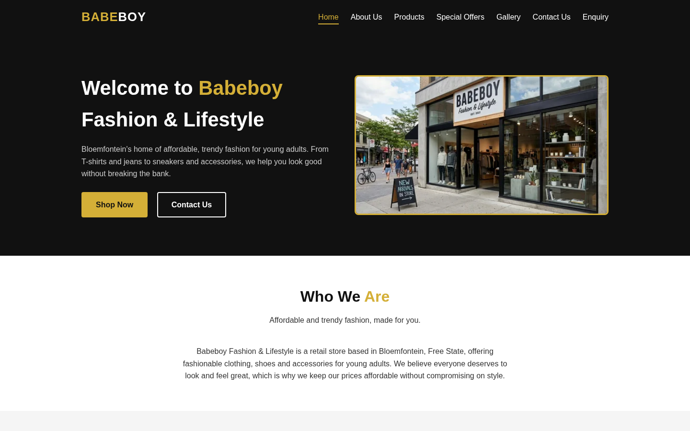
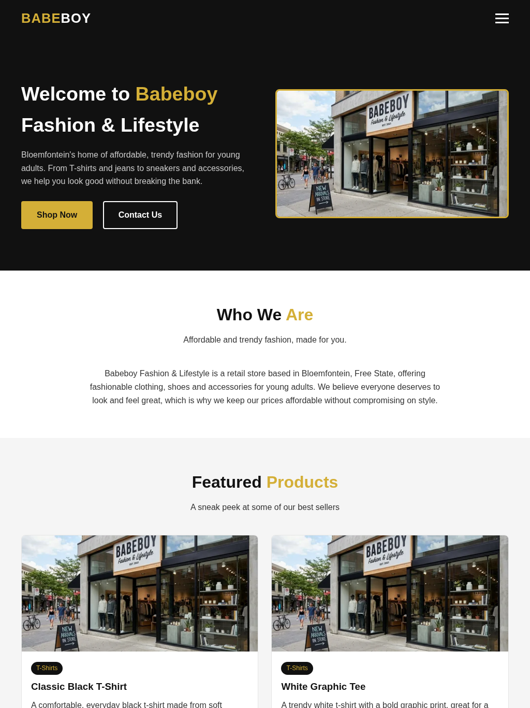
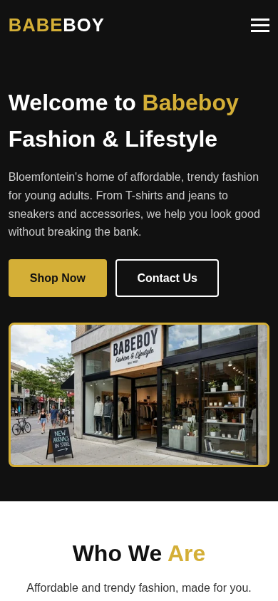

# Babeboy Fashion & Lifestyle Website

A static, multi-page marketing website for **Babeboy Fashion & Lifestyle**, a fictional clothing and accessories retail store based in Bloemfontein, Free State, South Africa. The site showcases the store's product catalogue, promotions, and contact information, and is built as a foundation that can later be extended to support online ordering and payment.

---

## Table of Contents

1. [Overview](#overview)
2. [Tech Stack](#tech-stack)
3. [Project Structure](#project-structure)

| | |
|---|---|
| **Organisation** | Babeboy Fashion & Lifestyle |
| **Industry** | Clothing & Fashion (Retail) |
| **Location** | Bloemfontein, Free State, South Africa |
| **Site type** | Static, client-side rendered, multi-page website |
| **Purpose** | Advertise products online, promote offers, and provide a contact channel for a physical retail store |

The site does **not** currently process real transactions, it is an informational and promotional front end. Product data is bundled with the site rather than served by a backend/database.

## Tech Stack

This project intentionally uses **no build tools, frameworks, or package managers**. It is written in plain, framework-free code so it can be understood, maintained, and extended by a beginner developer.

| Layer | Technology |
|---|---|
| Markup | HTML5 |
| Styling | CSS3 (hand-written, no preprocessor or framework) |
| Behaviour | JavaScript  |
| Maps | Embedded Google Maps  |

There is no server-side code, database, or API in this repository. Everything runs entirely in the browser.

## Project Structure

```
babeboy-website/
├── index.html          # Homepage
├── about.html           # About Us page
├── products.html         # Product catalogue with category filtering
├── offers.html           # Special offers / promotions
├── gallery.html          # Image gallery
├── contact.html          # Contact details, maps, contact form
├── enquiry.html           # Product enquiry form
│
├── css/
│   └── style.css         # Single global stylesheet for all pages
│
├── js/
│   └── script.js         # All client-side behaviour (see below)
│
├── data/
│   └── products.js        # Product catalogue, as a JS array (the "database")
│
├── images/               # (empty by default) Place local product photos here
│
└── README.md              # This file
```

### Screenshot evidence

The following screenshots were captured from the completed Part 2 build at representative viewport sizes. They demonstrate the responsive behaviour on different device classes.

#### Desktop — laptop / desktop browser (1440 × 900)



#### Tablet — iPad-style viewport (1024 × 1366)



#### Mobile — iPhone-style viewport (390 × 844)




## Changelog

### Part 2 — 18 September 2026

- Added explicit **mobile, tablet and desktop breakpoints** in `css/style.css`.
- Added responsive two-column tablet and four-column desktop product/gallery layouts.
- Added mobile single-column layouts and improved mobile filter-button wrapping.
- Converted responsive typography and spacing to relative `rem`/`em` units where appropriate.
- Changed layout sizing to use percentage-based container widths and fluid Grid/Flexbox behaviour.
- Added `<picture>`, `srcset`, and `sizes` responsive-image patterns to static page imagery.
- Updated JavaScript product rendering to generate responsive image markup dynamically.
- Added local WebP image variants at multiple widths for the supplied JPG assets.
- Added `loading="lazy"` to content images to reduce unnecessary initial image loading.
- Added desktop, tablet and mobile screenshot evidence under `screenshots/` and documented the device/viewport sizes in this README.
- Updated the README with Part 2 implementation details, responsive-design verification, changelog entries and refreshed references.
- Retained the **mobile hamburger navigation** and expanded it into a breakpoint-based responsive navigation system rather than replacing the existing interaction.
- Retained the existing **product category filtering**, enquiry form feedback, contact form feedback and automatic footer year functionality while updating product image rendering for responsive delivery.
- Retained the existing **seven-page multi-page structure** and plain HTML/CSS/JavaScript approach so the Part 2 changes remain compatible with the original project architecture.
